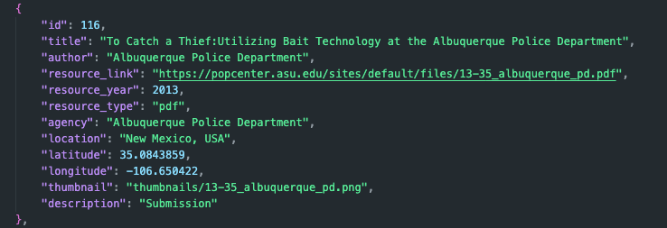

# POP Open Data Sets

This is a collection of data sets that I have gathered that are relevant to Problem Oriented Policing (POP). The data sets are available in the `data/` directory. Many of these data sets have been collected from open sources, such as the POP Center website. In some cases, the data has been augmented with additional information such as geocoding specific locations or generating thumbnail images of the data. 

This repo also contains an interactive site that allows users to explore the data sets in a more interactive way. All of the data and the site are available under the MIT license and are hosted on GitHub.

## The Interactive Site
You can visit the site at [popdatasets.com](https://popdatasets.com). The site is a simple way to explore the data sets that are available in this repository. The site is built using the vanilla JavaScript, the [Leaflet](https://leafletjs.com/) library for mapping, [Tailwind CSS](https://tailwindcss.com) for styling.

## The Available Data Sets

### Crime Data
Coming soon...maybe...

### Analysis Examples
Coming soon...also maybe...

### POP Center Problem-Oriented Data 
This is a collection of information on POP projects and materials collected from the [POP Center](https://popcenter.asu.edu/content/about) website. It is in a JSON format and includes the following fields: 

- `id`: The unique identifier for the project.
- `title`: The title of the project.
- `author`: The author of the project.
- `resource_link`: A link to the project submission (usually .pdf but .docx in some cases).
- `resource_year`: The year the project was submitted.
- `resource_type`: The type of file that the project submission is.
- `agency`: The name of the agency that submitted the project.
- `location`: The location of the agency.
- `latitude`: The latitude of the agency.
- `longitude`: The longitude of the agency.
- `thumbnail`: A thumbnail image of the project submission.
- `description`: A brief description of resource ("Submission", "Finalist", "Winner", "Problem Guide", etc.).

### Goldstein Award Submissions

The award data has been collected from the [POP Center](https://popcenter.asu.edu/content/about) website. The data is available in the [`data/`](https://github.com/michael-zidar/pop_projects/tree/main/data) directory of the repo. 

These data are submissions for the [Herman A. Goldstein Award for Excellence in Problem-Oriented Policing](https://popcenter.asu.edu/content/pop-projects). The award is given to agencies that have implemented a successful POP project. The data includes the agency name, the project title, the year the project was submitted, a link to the project submission, and the award status. These data have also been geocoded to include the location of the agency.

The data is available in the `data/project_data.csv` file. The data is in CSV (Can be opened with MS Excel) format and includes the following fields:

- `agency`: The name of the agency that submitted the project.
- `location`: The location of the agency.
- `project_title`: The title of the project.
- `year`: The year the project was submitted.
- `project_link`: A link to the project submission (usually .pdf but docx in some cases).
- `award_status`: The status of the award.
- `file_type`: The type of file that the project submission is.
- `latitude`: The latitude of the agency.
- `longitude`: The longitude of the agency.
- `formatted_address`: The formatted address of the agency.
- `place_id`: The Google Place ID of the agency.
- `types`: The type of location.
- `street_number`: The street number of the agency.
- `route`: The route of the agency.
- `locality`: The locality of the agency.
- `sublocality`: The sublocality of the agency.
- `administrative_area_level_1`: The administrative area level 1 of the agency.
- `administrative_area_level_2`: The administrative area level 2 of the agency.
- `country`: The country of the agency.
- `postal_code`: The postal code of the agency.

### POP Center Publications (Guides and Toolkits)

These data are just a collection of the POP Tool, Response, and Problem specific guides produced by the POP Center. They contain links to the guide PDF and/or the POP center page for the guide. 

