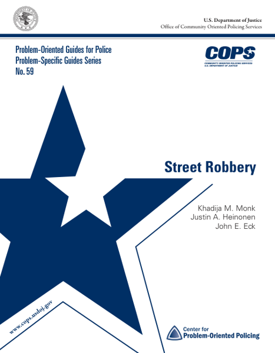

# POP Data Sets

This repository contains a collection of data sets related to Problem-Oriented Policing (POP), which can be found in the [`data/`](https://github.com/michael-zidar/pop_projects/tree/main/data)  directory. Many of these data sets have been sourced from open platforms like the POP Center website. In some instances, the data has been enriched with additional information, such as geocoding specific locations or generating thumbnail images.

The repository also includes an interactive site that allows users to explore these data sets more dynamically. Both the data and the site are available under the MIT license and are hosted on GitHub.


## The Goal
The aim of this site is to provide Problem Oriented Policing information to police departments, researchers, companies, and the public in a way that enables them to make things. These data can help with problem solving projects, be used to create Retrieval Augmented Generation (RAG) systems that leverage AI to generate useful information, or be used to create visualizations that help people understand the data better. The data is available in a structured format that can be easily downloaded and used in a variety of ways.

I hope these data sets can be used to help improve policing practices, reduce crime, and make communities safer. These data contain road maps to reducing crime. 

## The Interactive Site - [popdatasets.com](https://popdatasets.com)

You can explore the data sets on the site at [popdatasets.com](https://popdatasets.com). This simple, interactive platform is built using HTML, CSS, and vanilla JavaScript. 

#### Site Sections
- **[about](https://popdatasets.com/index.html)**: A brief overview of the site and the data sets (This page!).
- **[data](https://popdatasets.com/download.html)**: A list of the available data sets with links to download the data from the repo.
- **[guides](https://popdatasets.com/guides.html)**: A collection of POP Center guides and toolkits.
- **[projects](https://popdatasets.com/projects.html)**: An interactive map of POP Center projects and award submissions.

#### Libraries Used
- [Leaflet](https://leafletjs.com/): An open-source JS library interactive maps.
- [Tailwind CSS](https://tailwindcss.com): For styling.
- [Marked](https://github.com/markedjs/marked): A markdown parser and compiler.
- [Apexcharts](https://apexcharts.com/): A modern charting library to create interactive visualizations.


## In the Works
> **Note**: This project is still in development. Here are some of the features that are planned for the future:
> - **Example Scripts**: Provide example scripts for downloading and analyzing the data sets.
> - **AI-Generated Summaries**: Use AI to generate summaries of the POP Center guides.
> - **Crime Data Links**: Add links to crime data sets that can be used for testing and analysis.
> - **Policy Data Sets**: Add data sets related to policing policies and practices.


## The Available Data Sets

### POP Center Problem-Oriented Data

This is a collection of information on POP projects and materials collected from the [POP Center](https://popcenter.asu.edu/content/about) website. It is provided in a JSON format and includes the following fields:

- `id`: The unique identifier for the project.
- `title`: The title of the project.
- `author`: The author of the project.
- `resource_link`: A link to the project submission (usually .pdf but sometimes .docx).
- `resource_year`: The year the project was submitted.
- `resource_type`: The type of file that the project submission is.
- `agency`: The name of the agency that submitted the project.
- `location`: The location of the agency.
- `latitude`: The latitude of the agency.
- `longitude`: The longitude of the agency.
- `thumbnail`: A thumbnail image of the project submission.
- `description`: A brief description of the resource (e.g., "Submission", "Finalist", "Winner", "Problem Guide").


### POP Center Publications (Guides and Toolkits)

These data are a collection of the POP Tool, Response, and Problem-specific guides produced by the POP Center. They contain links to the guide PDFs and/or the POP Center page for each guide.

#### Examples of the available guides:

|  |  |  |  |
|:----------------------------------:|:----------------------------------:|:----------------------------------:|:----------------------------------:|

All of the guides can be found in the [`data/`](https://github.com/michael-zidar/pop_projects/tree/main/data) directory. The thumbnail images generated for each guide are also available in the repository along with the thumbnails generated for each of the Goldstein Award submissions.


### Goldstein Award Submissions

The award data has been collected from the [POP Center](https://popcenter.asu.edu/content/about) website and is available in the [`data/`](https://github.com/michael-zidar/pop_projects/tree/main/data) directory of the repository.

These data are submissions for the [Herman Goldstein Award for Excellence in Problem-Oriented Policing](https://popcenter.asu.edu/content/pop-projects), given to agencies that have implemented successful POP projects. The data includes the agency name, project title, year of submission, a link to the project submission, and the award status. The data has also been geocoded to include the agency's location.

The data is available in the `data/project_data.csv` file in CSV format (can be opened with MS Excel) and includes the following fields:

- `agency`: The name of the agency that submitted the project.
- `location`: The location of the agency.
- `project_title`: The title of the project.
- `year`: The year the project was submitted.
- `project_link`: A link to the project submission (usually .pdf but sometimes .docx).
- `award_status`: The status of the award.
- `file_type`: The type of file that the project submission is.
- `latitude`: The latitude of the agency.
- `longitude`: The longitude of the agency.
- `formatted_address`: The formatted address of the agency.
- `place_id`: The Google Place ID of the agency.
- `types`: The type of location.
- `street_number`: The street number of the agency.
- `route`: The route of the agency.
- `locality`: The locality of the agency.
- `sublocality`: The sublocality of the agency.
- `administrative_area_level_1`: The administrative area level 1 of the agency.
- `administrative_area_level_2`: The administrative area level 2 of the agency.
- `country`: The country of the agency.
- `postal_code`: The postal code of the agency.


## Example Use Cases

#### Downloading Guide Data

This example uses Python and the pandas library to download the guide data and save it to a CSV file. The data is loaded from the JSON file and filtered for guides that are Tool Guides. The filtered data is then saved to a CSV file.

```python
import pandas as pd

# Load the data
data = pd.read_json('https://raw.githubusercontent.com/michael-zidar/pop_projects/main/data/content.json')

# Filter the data for guides to just the Tool Guides
guides = data[data['resource_type'] == 'Tool Guide']

# Save the guide data to a CSV file
guides.to_csv('tool_guides.csv', index=False)
```
